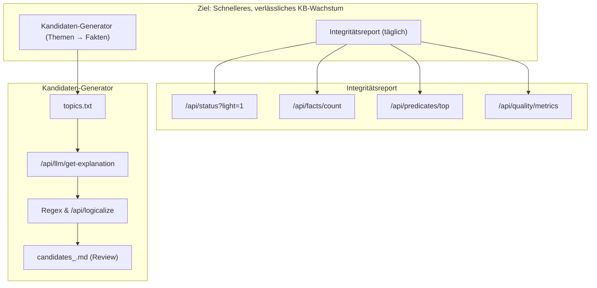

# Screenshot – KB-Beschleunigung (Integritätsreport + Kandidaten-Generator)

Datum: 2025-08-14
Autor: GPT-5

Kurzüberblick:
- `scripts/generate_integrity_report.py`: schreibt nach `PROJECT_HUB/reports/knowledge_integrity_<ts>.md` (Status, Counts, Top-Predicates, Quality).
- `scripts/generate_candidates_from_topics.py`: liest `PROJECT_HUB/topics.txt`, erzeugt `PROJECT_HUB/reports/candidates_<ts>.md` zur Human-Review.

Empfohlener Tagesablauf:
1. Themenliste pflegen: `PROJECT_HUB/topics.txt`
2. Kandidaten erzeugen:
   - ` .\.venv_hexa\Scripts\python.exe scripts\generate_candidates_from_topics.py`
3. Review & Freigabe in `candidates_<ts>.md`, dann sichere Aufnahme (MCP/REST) mit Kontextquelle (z. B. `human_verified`).
