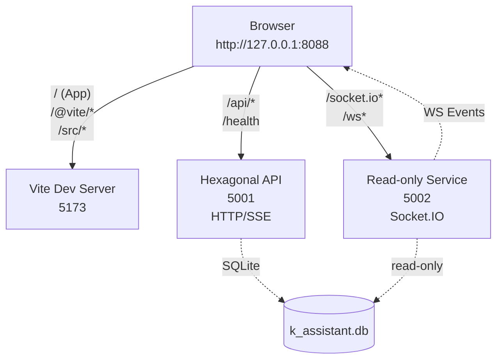

# Lokaler Start (PowerShell 7) – 5001, 5002, Frontend (5173) über Proxy 8088

Ziel: Backends (5001, 5002) + Frontend (5173) starten und alles sauber über `http://127.0.0.1:8088` vereinen.

## Reihenfolge (empfohlen)
1. 5001 (Hexagonal API, WS aus)
2. 5002 (Read‑only + Socket.IO)
3. Frontend (Vite 5173)
4. Proxy (Caddy 8088)

## 0) Vorbereitung
- PowerShell 7 (pwsh)
- Projektpfad: `D:\MCP Mods\HAK_GAL_HEXAGONAL`
- Frontend‑ENV: `frontend/.env.local`
  ```
  VITE_API_BASE_URL=http://localhost:8088
  VITE_API_KEY="hg_sk_4f9a8e1b7d2c5f6a8b3d9e0c1a7b4f9d"
  VITE_DEFAULT_BACKEND=hexagonal
  ```

## 1) 5001 starten (WS deaktiviert)
```powershell
cd "D:\MCP Mods\HAK_GAL_HEXAGONAL"
# optional venv aktivieren, falls benötigt
if (Test-Path .\.venv_hexa\Scripts\Activate.ps1) { . .\.venv_hexa\Scripts\Activate.ps1 }
python diagnostic_scripts\launch_NO_WEBSOCKET.py
# Health: http://127.0.0.1:5001/health
```

## 2) 5002 starten (Read‑only + WS)
```powershell
cd "D:\MCP Mods\HAK_GAL_HEXAGONAL"
if (Test-Path .\.venv_hexa\Scripts\Activate.ps1) { . .\.venv_hexa\Scripts\Activate.ps1 }
python diagnostic_scripts\launch_5002_FIXED.py
# Health: http://127.0.0.1:5002/health
```

## 3) Frontend starten (5173)
```powershell
cd "D:\MCP Mods\HAK_GAL_HEXAGONAL\frontend"
npm install --silent
npm run dev
# Dev: http://127.0.0.1:5173
```

## 4) Proxy (8088) starten
```powershell
# Start im Hintergrund mit Health‑Check
pwsh -NoProfile -File "D:\MCP Mods\HAK_GAL_HEXAGONAL\scripts\start_caddy.ps1"
# oder im Vordergrund (Logs sichtbar, Strg+C beendet)
pwsh -NoProfile -File "D:\MCP Mods\HAK_GAL_HEXAGONAL\scripts\start_caddy.ps1" -Foreground
# Proxy: http://127.0.0.1:8088
```

## 5) Verifikation über 8088
```powershell
Invoke-RestMethod http://127.0.0.1:8088/health | ConvertTo-Json -Compress
Invoke-RestMethod http://127.0.0.1:8088/api/facts/count | ConvertTo-Json -Compress
(Invoke-WebRequest http://127.0.0.1:8088/@vite/client -UseBasicParsing).StatusCode  # erwartet 200
```

## 6) Optional: p95‑Messung & Schreibtest
```powershell
# p95 für Facts‑Count via Proxy
pwsh -NoProfile -File "D:\MCP Mods\HAK_GAL_HEXAGONAL\scripts\p95_proxy_health.ps1" -Url 'http://127.0.0.1:8088/api/facts/count' -N 50 -DelayMs 30

# Schreibtest mit API‑Key
pwsh -NoProfile -File "D:\MCP Mods\HAK_GAL_HEXAGONAL\scripts\post_fact_verify.ps1"
```

## Ein‑Fenster‑Start vs. Mehr‑Fenster‑Start
- Oben sind die Einzelbefehle (gut für Diagnose).
- Alternativ: Nutze `scripts/start_all_ps7_windows.ps1`, um alle Komponenten in separaten PS‑Fenstern zu starten.

## Skizze – Verknüpfung


- 5001: schnelle HTTP/SSE (WS aus), SQLite Repository.
- 5002: Read‑only, sendet WS‑Events für UI.
- Frontend nutzt `VITE_API_BASE_URL=8088` und sendet `X-API-Key`.

