# 🤝 AUFGABENTEILUNG: OPUS 4.1 & SONNET 4
## Optimierte Kollaboration für HAK_GAL Verbesserungen

---

## 📋 VERBESSERUNGSPOTENTIAL - PRIORISIERT

1. **LLM Governor Implementation** (Kritisch)
2. **Semantic Duplicate Detection** (Wichtig)
3. **Domain-Relevanz Optimierung** (Nice-to-have)

---

## 🧠 CLAUDE OPUS 4.1 - AUFGABEN
### (Komplexe Architektur & Wissenschaftliche Analyse)

### **1. LLM GOVERNOR - ARCHITEKTUR & DESIGN**
```yaml
Verantwortung: System-Design & Evaluation Framework
Deliverables:
  - LLM Governor Architektur-Dokument
  - Evaluation Criteria & Scoring Matrix
  - Provider-Strategie (Groq vs Local vs Mock)
  - Wissenschaftliche Validierung-Methodik
  - Performance-Impact Analyse

Tasks:
  1. Erstelle detailliertes UML-Diagramm der Governor-Pipeline
  2. Definiere exakte Scoring-Algorithmen (0-1 Normalisierung)
  3. Entwickle Hybrid-Strategie (Thompson + LLM optimal mix)
  4. Benchmark-Design mit statistischer Signifikanz
  5. ROI-Analyse (Qualität vs Latenz/Kosten)
```

**KONKRETE DATEI:**
```python
# PROJECT_HUB/architecture/llm_governor_design.md
- Vollständige technische Spezifikation
- Mathematische Formeln für Scoring
- Entscheidungsbaum für Hybrid-Mode
- Test-Protokoll mit Hypothesen
```

### **2. SEMANTIC DUPLICATE DETECTION - THEORIE**
```yaml
Verantwortung: Algorithmus-Design & Mathematische Grundlagen
Deliverables:
  - Embedding-Strategie (Sentence-BERT vs Ada-002)
  - Similarity-Metriken (Cosine vs Euclidean)
  - Threshold-Kalibrierung wissenschaftlich
  - Skalierungs-Strategie für 100k+ Facts

Tasks:
  1. Vergleiche Embedding-Modelle (Accuracy vs Speed)
  2. Entwickle Clustering-Strategie für Effizienz
  3. Definiere False-Positive/Negative Toleranzen
  4. Cache-Strategie für Embeddings
```

**KONKRETE DATEI:**
```python
# PROJECT_HUB/research/semantic_duplicate_theory.md
- Mathematische Beweise für Similarity
- Benchmark verschiedener Embeddings
- O(n²) → O(n log n) Optimierung
```

### **3. DOMAIN-RELEVANZ - WISSENSCHAFTLICHE METRIKEN**
```yaml
Verantwortung: Domain-Taxonomie & Scoring-Modelle
Deliverables:
  - Hierarchische Domain-Ontologie
  - Cross-Domain Relevance Matrix
  - Information-Theoretic Scoring
  - Domain-Balance Algorithmus

Tasks:
  1. Erstelle vollständige Domain-Taxonomie (44+ Domains)
  2. Definiere Inter-Domain Relationships
  3. Entwickle Entropy-basierte Balance-Metrik
  4. Multi-Label Classification Strategy
```

---

## ⚡ CLAUDE SONNET 4 - AUFGABEN
### (Schnelle Implementation & Praktische Lösungen)

### **1. LLM GOVERNOR - IMPLEMENTATION**
```yaml
Verantwortung: Code-Implementation & Integration
Deliverables:
  - llm_governor_adapter.py (funktionsfähig)
  - Mock-Provider für Tests
  - Groq-Integration mit Error-Handling
  - Performance-Logging & Monitoring

Tasks:
  1. Implementiere LLMGovernorAdapter Klasse
  2. Erstelle evaluate_fact() Methode
  3. Baue Groq API Integration
  4. Schreibe Unit-Tests (pytest)
  5. Integriere in governor_extended_adapter.py
```

**KONKRETE BEFEHLE:**
```bash
# Installation
pip install groq sentence-transformers

# Test Mock Provider
python src_hexagonal/adapters/llm_governor_adapter.py --test

# Integration Test
python governor_extended.py --use-llm-governor
```

### **2. SEMANTIC DUPLICATE DETECTION - CODING**
```yaml
Verantwortung: Embedding-Pipeline & Caching
Deliverables:
  - semantic_duplicate_detector.py
  - FAISS Index für schnelle Suche
  - Redis Cache für Embeddings
  - REST API Endpoint

Tasks:
  1. Implementiere SentenceTransformers Pipeline
  2. Baue FAISS Index mit 4,557 Facts
  3. Erstelle duplicate_check() Funktion
  4. API Endpoint: POST /api/check_duplicate
  5. Batch-Processing für bestehende KB
```

**KONKRETE IMPLEMENTATION:**
```python
# src_hexagonal/services/semantic_duplicate_service.py
from sentence_transformers import SentenceTransformer
import faiss
import numpy as np

class SemanticDuplicateDetector:
    def __init__(self):
        self.model = SentenceTransformer('all-MiniLM-L6-v2')
        self.index = faiss.IndexFlatL2(384)  # Embedding dim
        
    def check_duplicate(self, fact: str, threshold: float = 0.85):
        embedding = self.model.encode([fact])
        distances, indices = self.index.search(embedding, k=5)
        
        if distances[0][0] < (1 - threshold):
            return True, indices[0][0]  # Duplicate found
        return False, None
```

### **3. DOMAIN-RELEVANZ - PRAKTISCHE TOOLS**
```yaml
Verantwortung: Domain-Classifier & Auto-Tagging
Deliverables:
  - domain_classifier.py mit Sklearn
  - Auto-Tagging für neue Facts
  - Domain-Balance Dashboard Widget
  - Rebalancing Script

Tasks:
  1. Trainiere Domain-Classifier (RandomForest)
  2. Implementiere auto_tag_domain() Funktion
  3. Erstelle Balance-Visualisierung (Plotly)
  4. Schreibe rebalance_domains.py Script
  5. API: GET /api/domain_stats
```

---

## 🔄 SYNCHRONISATION & HANDOVER

### **KOMMUNIKATIONS-PROTOKOLL**
```yaml
Datenaustausch:
  - Gemeinsamer Ordner: PROJECT_HUB/collaboration/
  - Status-Updates: agent_hub/{model}/status.json
  - Test-Daten: PROJECT_HUB/test_data/shared/

Sync-Points:
  1. Nach Architektur-Design (Opus → Sonnet)
  2. Nach Mock-Implementation (Sonnet → Opus)  
  3. Nach Benchmark-Results (Opus → Sonnet)
  4. Final Integration (Beide)
```

### **ZEITPLAN**

```mermaid
gantt
    title Opus & Sonnet Collaboration Timeline
    dateFormat  HH:mm
    section Opus 4.1
    LLM Gov Design    :a1, 00:00, 2h
    Semantic Theory   :a2, after a1, 1h
    Domain Metrics    :a3, after a2, 1h
    Validation        :a4, after a3, 1h
    
    section Sonnet 4
    Wait for Design   :b1, 00:00, 2h
    LLM Gov Code      :b2, after b1, 2h
    Semantic Code     :b3, after b2, 1h
    Domain Tools      :b4, after b3, 1h
    
    section Integration
    Merge & Test      :c1, after b4, 1h
```


---

## 📊 SUCCESS METRICS

### **FÜR OPUS 4.1:**
- [ ] Architektur-Dokumente vollständig
- [ ] Wissenschaftliche Validierung durchgeführt
- [ ] Performance-Impact < 20% Overhead
- [ ] ROI positiv (Qualität > Kosten)

### **FÜR SONNET 4:**
- [ ] Alle 3 Services implementiert
- [ ] Unit-Tests > 80% Coverage
- [ ] Integration Tests passing
- [ ] API Endpoints funktional

### **GEMEINSAM:**
- [ ] Duplikate um 90% reduziert
- [ ] Domain-Balance < 10% Deviation
- [ ] Governance Acceptance Rate > 75%
- [ ] System bleibt unter 100ms Latenz

---

## 🚀 START-BEFEHLE

### **FÜR OPUS 4.1:**
```python
# Beginne mit Architektur
hak-gal.create_file(
    path="PROJECT_HUB/architecture/llm_governor_design.md",
    content=llm_governor_architecture
)

# Erstelle Evaluation Framework
design_evaluation_criteria()
benchmark_scoring_algorithms()
```

### **FÜR SONNET 4:**
```python
# Warte auf Opus Design, dann:
# Implementiere Mock Provider
cd D:\MCP Mods\HAK_GAL_HEXAGONAL
python src_hexagonal/adapters/llm_governor_adapter.py --mock

# Teste Semantic Duplicate
pip install sentence-transformers
python -c "from sentence_transformers import SentenceTransformer; print('Ready')"
```

---

## ⚠️ KRITISCHE ABHÄNGIGKEITEN

1. **Opus MUSS zuerst:** Architektur definieren
2. **Sonnet WARTET auf:** Design-Dokumente  
3. **Parallel möglich:** Semantic Theory (Opus) + Mock Code (Sonnet)
4. **Final zusammen:** Integration & Testing

---

## 📝 NOTES FÜR BEIDE

**Opus:** Fokus auf Korrektheit über Speed. Lieber gründlich als schnell.

**Sonnet:** Fokus auf funktionierende Prototypen. Iterativ verbessern.

**Beide:** Dokumentiert ALLES in PROJECT_HUB. Keine isolierten Lösungen!

---

*Task Distribution v1.0 - Optimiert für Stärken*
*Erstellt von Claude Opus 4.1*
*Für effiziente Kollaboration*