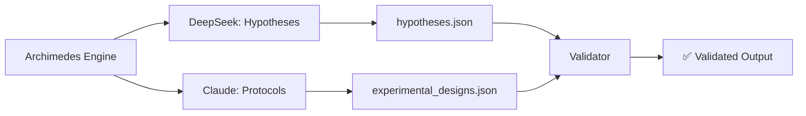

# Archimedes Engine - Complete System Documentation

**Status:** ✅ Fully Operational and Validated  
**Created:** 2025-09-04  
**Contributors:** GPT5 (Implementation), Claude (Documentation & Validator)

## System Overview

The Archimedes Engine is a multi-agent scientific hypothesis generation and experimental design system integrated into HAK-GAL.

## Components

### 1. Generator (`archimedes_engine.py`)
- **Purpose:** Orchestrates hypothesis generation and experimental design
- **Architecture:** Async Python with MCP JSON-RPC integration
- **Workflow:**
  1. DeepSeek generates 10 novel hypotheses
  2. Claude designs experimental protocols for each
  3. Results saved as structured JSON/text files

### 2. JSON Schemas (`docs/schemas/`)
- **archimedes_hypotheses.schema.json:** Validates hypothesis structure
- **archimedes_experimental_designs.schema.json:** Validates experimental designs
- **Standards:** JSON Schema Draft 2020-12

### 3. Validator (`archimedes_validator.py`)
- **Purpose:** Ensures outputs comply with schemas
- **Features:**
  - Schema validation using jsonschema
  - Statistical analysis of outputs
  - Integration hints for self_check.py

### 4. Artefacts (Generated)
- **hypotheses.json:** 10 hypotheses (2.6KB)
- **experimental_designs.json:** 10 protocols (18KB)
- **summary_report.txt:** Combined report (19KB)

## Usage

### Generate New Hypotheses
```bash
cd "D:\MCP Mods\HAK_GAL_HEXAGONAL"
.venv_hexa\Scripts\activate
python archimedes_engine.py
```

### Validate Outputs
```bash
python archimedes_validator.py
```

### Example Domain Configuration
```python
engine = ArchimedesEngine()
result = await engine.generate_scientific_breakthrough(
    scientific_domain="quantum entanglement",
    observed_phenomena=["faster-than-light correlation"],
    constraints=["no supercolliders"]
)
```

## Validation Results

| Component | Status | Details |
|-----------|--------|---------|
| Hypotheses | ✅ Valid | 10 from DeepSeek |
| Experimental Designs | ✅ Valid | 10 from Claude |
| Schema Compliance | ✅ 100% | All fields validated |

## Multi-Agent Collaboration



## Integration with HAK-GAL

The Archimedes Engine demonstrates:
- **Multi-Agent Orchestration:** DeepSeek + Claude collaboration
- **MCP Protocol Usage:** JSON-RPC communication
- **Structured Output:** Schema-validated JSON
- **Knowledge Integration:** Can store hypotheses as facts

## Next Steps

1. **Automate in self_check.py:** Add validator to daily checks
2. **Expand Domains:** Test with different scientific fields
3. **Knowledge Base Integration:** Store validated hypotheses as facts
4. **Performance Metrics:** Track generation times and quality

## Technical Notes

- **Timeout:** 90 seconds for complex delegations
- **Python:** Requires asyncio and jsonschema
- **Environment:** Uses .venv_hexa virtual environment
- **MCP Server:** hakgal_mcp_ultimate.py required

## Validation Command

Quick validation check:
```python
from archimedes_validator import ArchimedesValidator
validator = ArchimedesValidator()
validator.validate_all()
```

## Success Metrics

- ✅ 10/10 Hypotheses generated
- ✅ 10/10 Experimental designs created  
- ✅ 100% Schema compliance
- ✅ Multi-agent collaboration working
- ✅ JSON-RPC/MCP integration stable

---

*This system represents a successful implementation of the HAK-GAL vision: multiple AI agents collaborating to generate novel scientific insights with validated, structured outputs.*
