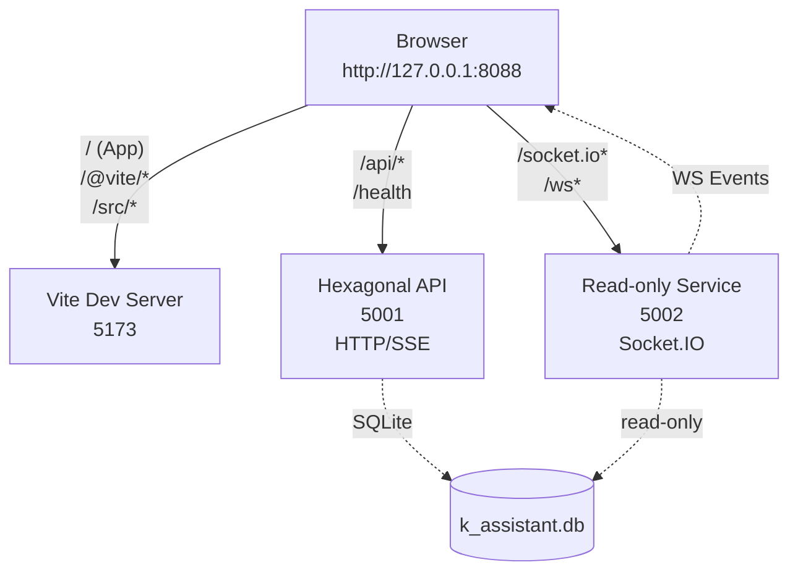

# HAK‑GAL Hexagonal – Lokaler Startguide (Windows)

Ziel: 5001 (Hexa, HTTP/SSE), 5002 (Hexa Read‑only/WS, optional C++/Mojo), Frontend 5173 – alles sauber über Proxy 8088 vereinen.

## 1) Vorbereitung
- PowerShell 7 (pwsh)
- Python venv aktiv (falls nötig): `.venv_hexa`
- Frontend ENV: `frontend/.env.local`
  ```
  VITE_API_BASE_URL=http://localhost:8088
  VITE_API_KEY="hg_sk_${HAKGAL_AUTH_TOKEN}"
  VITE_DEFAULT_BACKEND=hexagonal
  ```

## 2) Backends starten
Aus `D:\MCP Mods\HAK_GAL_HEXAGONAL`:

- 5001 – Hexagonal API (WebSocket AUS, für Latenz)
  ```powershell
  python diagnostic_scripts\launch_NO_WEBSOCKET.py
  ```
  Health: `http://127.0.0.1:5001/health`

- 5002 – Read‑only + WebSocket
  ```powershell
  # Option FIXED (empfohlen)
  python diagnostic_scripts\launch_5002_FIXED.py
  # Alternativ:
  # python diagnostic_scripts\launch_5002_MOJO_FINAL.py
  ```
  Health: `http://127.0.0.1:5002/health`

Hinweis: 5002 liefert WS‑Events (Socket.IO) für UI/Monitoring; 5001 bleibt ohne WS für beste Latenz.

## 3) Frontend starten (5173)
Aus `D:\MCP Mods\HAK_GAL_HEXAGONAL\frontend`:
```powershell
npm install --silent
npm run dev
```
Dev‑URL (direkt): `http://127.0.0.1:5173`

## 4) Reverse‑Proxy (8088) starten
Konfiguration: `D:\MCP Mods\HAK_GAL_HEXAGONAL\Caddyfile`
Binary: `D:\MCP Mods\HAK_GAL_HEXAGONAL\caddy.exe`

Start (hintergrund):
```powershell
pwsh -NoProfile -File "D:\MCP Mods\HAK_GAL_HEXAGONAL\scripts\start_caddy.ps1"
```
Proxy‑Origin: `http://127.0.0.1:8088`

Routing (aus der Caddyfile):
- `/@vite/client`, `/@vite/*`, `/src/*` → 5173 (mit `Content-Type: application/javascript`)
- `/` → 5173 (Frontend)
- `/api/*`, `/health` → 5001 (HTTP/SSE)
- `/socket.io*`, `/ws*` → 5002 (WebSocket)

## 5) Verifikation (Proxy‑Origin)
```powershell
Invoke-RestMethod http://127.0.0.1:8088/health | ConvertTo-Json -Compress
Invoke-RestMethod http://127.0.0.1:8088/api/facts/count | ConvertTo-Json -Compress
```
Erwartung: Status OK, Zähler > 0.

## 6) End‑to‑End Tests (optional)
- p95 Latenz über Proxy:
  ```powershell
  pwsh -NoProfile -File "D:\MCP Mods\HAK_GAL_HEXAGONAL\scripts\p95_proxy_health.ps1" -Url 'http://127.0.0.1:8088/api/facts/count' -N 50 -DelayMs 30
  ```
- Schreibtest (API‑Key):
  ```powershell
  pwsh -NoProfile -File "D:\MCP Mods\HAK_GAL_HEXAGONAL\scripts\post_fact_verify.ps1"
  ```

## 7) Startreihenfolge (empfohlen)
1. 5001 starten (NO_WEBSOCKET)
2. 5002 starten (FIXED/MOJO)
3. Frontend `npm run dev`
4. Proxy 8088 (Caddy)
5. Browser: `http://127.0.0.1:8088` (Ein‑Origin; keine CORS/Ports im Code)

## 8) Troubleshooting
- Proxy 8088 verweigert Verbindung:
  - Port belegt? Caddy im Vordergrund testen:
    ```powershell
    cd "D:\MCP Mods\HAK_GAL_HEXAGONAL"
    .\caddy.exe run --config .\Caddyfile --watch
    ```
- MIME‑Fehler (module script) auf 8088:
  - Sicherstellen, dass Vite läuft (5173)
  - Caddyfile enthält Header‑Regeln für `/@vite/client` und Module (bereits konfiguriert)
- WS Fehler bei 5001: dort ist WS absichtlich aus. UI verbindet per `/socket.io` → 5002.

## 9) Architektur – Verbindungsskizze


- Ein‑Origin: Browser spricht nur 8088.
- 5001: schnelle HTTP/SSE, keine WS, SQLite Repository.
- 5002: Read‑only, sendet WS‑Events für UI.
- Frontend nutzt ENV `VITE_API_BASE_URL` (8088) und sendet `X-API-Key`.

## 10) Kurz‑Checkliste
- 5001/5002 Health: 200 ✅
- Proxy 8088 Health: 200 ✅
- Frontend über 8088 erreichbar ✅
- API‑Key aktiv (schreibende Aktionen funktionieren) ✅
- p95 < 10 ms (lokal) ✅

—
Stand: 2025‑08‑17

