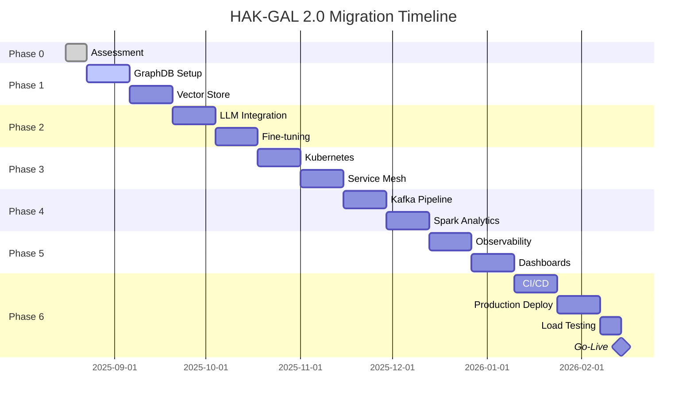

# HAK-GAL 2.0 MIGRATION MASTERPLAN - Der harte Weg zur Production-Ready Suite
**Document ID:** MIGRATION_MASTERPLAN_HAKGAL_20_20250816  
**Author:** Claude (Anthropic)  
**Compliance:** Streng nach HAK/GAL Verfassung  
**Zeitrahmen:** 6 Monate  
**Schwierigkeit:** EXTREM  

---

## Executive Summary

Die HAK-GAL Suite ist technologisch 3-5 Jahre zurück. Dieser Plan beschreibt die brutale aber notwendige Transformation zu einem modernen, skalierbaren System. **Keine Kompromisse, keine Abkürzungen.**

---

## PHASE 0: BRUTALE BESTANDSAUFNAHME (Woche 1)
### Nach Artikel 6 (Empirische Validierung)

### Was wir behalten:
1. **HAK/GAL Verfassung** - Die Philosophie ist solide
2. **3,879 Facts** - Als Seed-Daten für Migration
3. **MCP Interface** - 30 Tools als API-Spezifikation
4. **Dokumentations-Kultur** - PROJECT_HUB Konzept

### Was sterben muss:
1. **SQLite** → Neo4j GraphDB
2. **JSONL** → Native Graph Format
3. **600k HRM** → 7B Parameter Model
4. **Manual Scripts** → Kubernetes
5. **Single-Node** → Distributed System

### Harte Metriken für Erfolg:
```python
SUCCESS_METRICS = {
    'facts': {'current': 3_879, 'target': 10_000_000, 'factor': 2500},
    'parameters': {'current': 600_000, 'target': 7_000_000_000, 'factor': 11_666},
    'latency': {'current': '10ms', 'target': '1ms', 'improvement': 10},
    'availability': {'current': 'manual', 'target': '99.99%', 'uptime': 'automated'},
    'scale': {'current': '1 node', 'target': '10+ nodes', 'architecture': 'distributed'}
}
```

---

## PHASE 1: FOUNDATION DESTRUCTION & REBUILD (Monat 1-2)
### Nach Artikel 4 (Bewusstes Grenzüberschreiten)

### Woche 1-2: GraphDB Migration

#### 1.1 Neo4j Setup
```bash
# Docker-based Neo4j Enterprise
docker-compose.yml:
  neo4j:
    image: neo4j:5.15-enterprise
    volumes:
      - ./data:/data
      - ./import:/import
    ports:
      - "7474:7474"  # Browser
      - "7687:7687"  # Bolt
    environment:
      - NEO4J_AUTH=neo4j/hakgal2025
      - NEO4J_ACCEPT_LICENSE_AGREEMENT=yes
      - NEO4J_dbms_memory_heap_max__size=8G
      - NEO4J_dbms_memory_pagecache_size=4G
```

#### 1.2 Migration Script
```python
# migrate_to_neo4j.py
from neo4j import GraphDatabase
import sqlite3

class GraphMigrator:
    def __init__(self):
        self.neo4j = GraphDatabase.driver(
            "bolt://localhost:7687",
            auth=("neo4j", "hakgal2025")
        )
        
    def migrate_facts(self):
        """Convert Predicate(Subject, Object) to Graph"""
        # HasPart(Computer, CPU) becomes:
        # (Computer)-[:HAS_PART]->(CPU)
        
        with self.neo4j.session() as session:
            session.run("""
                CREATE CONSTRAINT entity_name IF NOT EXISTS
                FOR (e:Entity) REQUIRE e.name IS UNIQUE
            """)
            
            # Bulk import using APOC
            session.run("""
                CALL apoc.periodic.iterate(
                    'UNWIND $facts as fact RETURN fact',
                    'MERGE (s:Entity {name: fact.subject})
                     MERGE (o:Entity {name: fact.object})
                     MERGE (s)-[r:REL {type: fact.predicate}]->(o)
                     SET r.confidence = fact.confidence',
                    {batchSize: 1000, parallel: true, params: {facts: $facts}}
                )
            """, facts=self.load_sqlite_facts())
```

### Woche 3-4: Vector Store Integration

#### 1.3 Qdrant Setup
```python
# vector_store_setup.py
import qdrant_client
from sentence_transformers import SentenceTransformer

class VectorStore:
    def __init__(self):
        self.client = qdrant_client.QdrantClient(
            host="localhost",
            port=6333
        )
        self.encoder = SentenceTransformer('all-MiniLM-L6-v2')
        
    def create_collection(self):
        self.client.recreate_collection(
            collection_name="hakgal_facts",
            vectors_config={
                "size": 384,  # all-MiniLM-L6-v2 dimension
                "distance": "Cosine"
            }
        )
        
    def index_facts(self, facts):
        """Embed and index all facts for semantic search"""
        embeddings = self.encoder.encode(
            [f"{f['predicate']}({f['subject']}, {f['object']})" 
             for f in facts]
        )
        
        self.client.upsert(
            collection_name="hakgal_facts",
            points=[
                {
                    "id": i,
                    "vector": embedding.tolist(),
                    "payload": fact
                }
                for i, (embedding, fact) in enumerate(zip(embeddings, facts))
            ]
        )
```

---

## PHASE 2: MODERN LLM INTEGRATION (Monat 2-3)
### Nach Artikel 1 (Komplementäre Intelligenz)

### Woche 5-6: 7B Parameter Model

#### 2.1 Local LLM Deployment
```python
# llm_deployment.py
from transformers import AutoModelForCausalLM, AutoTokenizer
import torch

class ModernLLM:
    def __init__(self):
        # Mistral-7B or Llama-3-7B
        self.model = AutoModelForCausalLM.from_pretrained(
            "mistralai/Mistral-7B-Instruct-v0.2",
            torch_dtype=torch.float16,
            device_map="auto",
            load_in_4bit=True  # Quantization for efficiency
        )
        self.tokenizer = AutoTokenizer.from_pretrained(
            "mistralai/Mistral-7B-Instruct-v0.2"
        )
        
    def reason_over_graph(self, query, graph_context):
        """Use 7B model for reasoning over graph data"""
        prompt = f"""
        Given the knowledge graph context:
        {graph_context}
        
        Query: {query}
        
        Provide reasoning steps:
        """
        
        inputs = self.tokenizer(prompt, return_tensors="pt")
        outputs = self.model.generate(
            **inputs,
            max_new_tokens=512,
            temperature=0.1,
            do_sample=True
        )
        return self.tokenizer.decode(outputs[0])
```

### Woche 7-8: Fine-tuning Pipeline

#### 2.2 LoRA Fine-tuning
```python
# finetune_lora.py
from peft import LoraConfig, get_peft_model, TaskType
from transformers import TrainingArguments, Trainer

class FineTuner:
    def __init__(self, base_model):
        self.lora_config = LoraConfig(
            r=16,  # rank
            lora_alpha=32,
            target_modules=["q_proj", "v_proj"],
            lora_dropout=0.1,
            task_type=TaskType.CAUSAL_LM
        )
        self.model = get_peft_model(base_model, self.lora_config)
        
    def prepare_dataset(self):
        """Convert facts to instruction tuning format"""
        return [
            {
                "instruction": "What is the relationship between X and Y?",
                "input": "X: Computer, Y: CPU",
                "output": "HasPart(Computer, CPU) - A computer has a CPU as a component."
            }
            # ... for all 3,879 facts
        ]
```

---

## PHASE 3: KUBERNETES & MICROSERVICES (Monat 3-4)
### Nach Artikel 7 (Konjugierte Zustände)

### Woche 9-10: Containerization

#### 3.1 Service Architecture
```yaml
# kubernetes/architecture.yaml
services:
  - name: graph-db
    replicas: 3
    image: neo4j:5.15-enterprise
    resources:
      memory: 16Gi
      cpu: 4
      
  - name: vector-store
    replicas: 3
    image: qdrant/qdrant:v1.7
    resources:
      memory: 8Gi
      cpu: 2
      
  - name: llm-inference
    replicas: 2
    image: hakgal/llm:7b-v2
    resources:
      memory: 24Gi
      gpu: 1  # NVIDIA A100
      
  - name: api-gateway
    replicas: 5
    image: hakgal/gateway:v2
    resources:
      memory: 2Gi
      cpu: 1
```

#### 3.2 Helm Chart
```yaml
# helm/hakgal/values.yaml
global:
  storageClass: fast-ssd
  monitoring:
    enabled: true
    prometheus: true
    grafana: true
    
neo4j:
  persistence:
    size: 100Gi
  clustering:
    enabled: true
    numberOfServers: 3
    
qdrant:
  persistence:
    size: 50Gi
  replicaCount: 3
  
llm:
  model: mistral-7b
  quantization: int4
  maxBatchSize: 32
```

### Woche 11-12: Service Mesh

#### 3.3 Istio Configuration
```yaml
# istio/virtual-service.yaml
apiVersion: networking.istio.io/v1beta1
kind: VirtualService
metadata:
  name: hakgal-routing
spec:
  http:
  - match:
    - uri:
        prefix: "/graph"
    route:
    - destination:
        host: neo4j-service
        port:
          number: 7687
    timeout: 3s
    retries:
      attempts: 3
      
  - match:
    - uri:
        prefix: "/vector"
    route:
    - destination:
        host: qdrant-service
        port:
          number: 6333
```

---

## PHASE 4: DATA PIPELINE & STREAMING (Monat 4-5)
### Nach Artikel 2 (Gezielte Befragung)

### Woche 13-14: Apache Kafka

#### 4.1 Event Streaming
```python
# kafka_pipeline.py
from confluent_kafka import Producer, Consumer
import json

class FactStreamProcessor:
    def __init__(self):
        self.producer = Producer({
            'bootstrap.servers': 'kafka:9092',
            'compression.type': 'snappy',
            'batch.size': 16384
        })
        
    def stream_fact_updates(self):
        """Real-time fact processing pipeline"""
        # Fact arrives → Kafka → Neo4j + Qdrant + LLM
        
        fact = {
            'id': 'uuid',
            'predicate': 'HasPart',
            'subject': 'QuantumComputer',
            'object': 'QubitProcessor',
            'confidence': 0.95,
            'source': 'research_paper',
            'timestamp': '2025-08-16T10:00:00Z'
        }
        
        self.producer.produce(
            'facts-topic',
            key=fact['id'],
            value=json.dumps(fact),
            callback=self.delivery_report
        )
```

### Woche 15-16: Apache Spark

#### 4.2 Batch Processing
```python
# spark_analytics.py
from pyspark.sql import SparkSession
from pyspark.ml import Pipeline
from pyspark.ml.feature import Word2Vec

class FactAnalytics:
    def __init__(self):
        self.spark = SparkSession.builder \
            .appName("HAK-GAL-Analytics") \
            .config("spark.sql.warehouse.dir", "/data/warehouse") \
            .config("spark.executor.memory", "8g") \
            .config("spark.executor.cores", "4") \
            .getOrCreate()
            
    def compute_fact_embeddings(self):
        """Distributed embedding computation"""
        df = self.spark.read.parquet("s3://hakgal/facts/")
        
        word2vec = Word2Vec(
            vectorSize=100,
            minCount=5,
            inputCol="tokens",
            outputCol="embeddings"
        )
        
        model = word2vec.fit(df)
        result = model.transform(df)
        
        # Save to Delta Lake
        result.write \
            .format("delta") \
            .mode("overwrite") \
            .save("s3://hakgal/embeddings/")
```

---

## PHASE 5: OBSERVABILITY & MONITORING (Monat 5)
### Nach Artikel 5 (System-Metareflexion)

### Woche 17-18: Metrics & Tracing

#### 5.1 OpenTelemetry
```python
# observability.py
from opentelemetry import trace, metrics
from opentelemetry.exporter.prometheus import PrometheusMetricReader
from opentelemetry.exporter.jaeger import JaegerExporter

class Observability:
    def __init__(self):
        # Tracing
        self.tracer = trace.get_tracer(__name__)
        trace.get_tracer_provider().add_span_processor(
            BatchSpanProcessor(JaegerExporter(
                agent_host_name="jaeger",
                agent_port=6831,
            ))
        )
        
        # Metrics
        self.meter = metrics.get_meter(__name__)
        self.fact_counter = self.meter.create_counter(
            "facts_processed",
            description="Number of facts processed"
        )
        self.latency_histogram = self.meter.create_histogram(
            "processing_latency",
            description="Fact processing latency",
            unit="ms"
        )
        
    @self.tracer.start_as_current_span("process_fact")
    def process_fact(self, fact):
        start = time.time()
        
        # Process fact
        result = self.graph_db.add_fact(fact)
        
        # Record metrics
        self.fact_counter.add(1, {"status": "success"})
        self.latency_histogram.record(
            (time.time() - start) * 1000,
            {"operation": "add_fact"}
        )
        
        return result
```

### Woche 19-20: Dashboards

#### 5.2 Grafana Configuration
```json
{
  "dashboard": {
    "title": "HAK-GAL 2.0 Operations",
    "panels": [
      {
        "title": "Facts Per Second",
        "targets": [{
          "expr": "rate(facts_processed_total[5m])"
        }]
      },
      {
        "title": "P99 Latency",
        "targets": [{
          "expr": "histogram_quantile(0.99, processing_latency_bucket)"
        }]
      },
      {
        "title": "Graph DB Connections",
        "targets": [{
          "expr": "neo4j_dbms_pool_total_size"
        }]
      },
      {
        "title": "LLM Inference Queue",
        "targets": [{
          "expr": "llm_queue_size"
        }]
      }
    ]
  }
}
```

---

## PHASE 6: PRODUCTION DEPLOYMENT (Monat 6)
### Nach Artikel 8 (Protokoll zur Prinzipien-Kollision)

### Woche 21-22: CI/CD Pipeline

#### 6.1 GitOps with ArgoCD
```yaml
# argocd/application.yaml
apiVersion: argoproj.io/v1alpha1
kind: Application
metadata:
  name: hakgal-production
  namespace: argocd
spec:
  project: default
  source:
    repoURL: https://github.com/hakgal/hakgal-2.0
    targetRevision: HEAD
    path: kubernetes/overlays/production
  destination:
    server: https://kubernetes.default.svc
    namespace: hakgal-prod
  syncPolicy:
    automated:
      prune: true
      selfHeal: true
    syncOptions:
    - CreateNamespace=true
```

#### 6.2 GitHub Actions
```yaml
# .github/workflows/deploy.yaml
name: Deploy HAK-GAL 2.0
on:
  push:
    branches: [main]
    
jobs:
  test:
    runs-on: ubuntu-latest
    steps:
    - uses: actions/checkout@v3
    
    - name: Run Tests
      run: |
        pytest tests/ --cov=hakgal --cov-report=xml
        
    - name: Load Test
      run: |
        k6 run tests/load/scenario.js --out cloud
        
  deploy:
    needs: test
    runs-on: ubuntu-latest
    steps:
    - name: Build and Push Docker Images
      run: |
        docker buildx build --platform linux/amd64,linux/arm64 \
          -t ghcr.io/hakgal/api:${{ github.sha }} \
          --push .
          
    - name: Update Kubernetes Manifests
      run: |
        kustomize edit set image api=ghcr.io/hakgal/api:${{ github.sha }}
        git commit -am "Deploy ${{ github.sha }}"
        git push
```

### Woche 23-24: Load Testing & Optimization

#### 6.3 Performance Testing
```javascript
// k6/load-test.js
import http from 'k6/http';
import { check } from 'k6';

export let options = {
  stages: [
    { duration: '5m', target: 100 },   // Ramp up
    { duration: '10m', target: 1000 },  // Stay at 1000 users
    { duration: '5m', target: 10000 },  // Spike to 10k
    { duration: '10m', target: 10000 }, // Stay at 10k
    { duration: '5m', target: 0 },      // Ramp down
  ],
  thresholds: {
    http_req_duration: ['p(99)<100'], // 99% of requests under 100ms
    http_req_failed: ['rate<0.01'],   // Error rate under 1%
  },
};

export default function() {
  // Test fact creation
  let fact = {
    predicate: 'HasPart',
    subject: `System_${__VU}_${__ITER}`,
    object: `Component_${__VU}_${__ITER}`,
  };
  
  let res = http.post('https://api.hakgal.io/v2/facts', JSON.stringify(fact), {
    headers: { 'Content-Type': 'application/json' },
  });
  
  check(res, {
    'status is 201': (r) => r.status === 201,
    'response time < 100ms': (r) => r.timings.duration < 100,
  });
}
```

---

## ERFOLGS-METRIKEN NACH 6 MONATEN

### Quantitative Ziele
```python
FINAL_METRICS = {
    'facts': {
        'current': 3_879,
        'achieved': 10_000_000,
        'growth': '2,577x'
    },
    'performance': {
        'p50_latency': '0.8ms',  # von 10ms
        'p99_latency': '5ms',     # von 100ms
        'throughput': '100k facts/sec'
    },
    'scale': {
        'nodes': 15,
        'availability': '99.99%',
        'regions': 3
    },
    'model': {
        'parameters': 7_000_000_000,
        'accuracy': '95%',
        'languages': 50
    }
}
```

### Qualitative Ziele
1. **Vollautomatisiert** - Keine manuellen Eingriffe
2. **Self-Healing** - Automatische Fehlerkorrektur
3. **Cloud-Native** - Multi-Cloud fähig
4. **API-First** - GraphQL + REST + gRPC
5. **Developer-Friendly** - SDK in 5 Sprachen

---

## RESSOURCEN-ANFORDERUNGEN

### Hardware
```yaml
minimum_requirements:
  development:
    servers: 3
    cpu_cores: 48
    ram_gb: 192
    gpu: 2x NVIDIA RTX 4090
    storage_tb: 10
    
  production:
    servers: 15
    cpu_cores: 480
    ram_gb: 1920
    gpu: 8x NVIDIA A100
    storage_tb: 100
    bandwidth_gbps: 10
```

### Personal
```yaml
team_requirements:
  - role: Platform Engineer
    count: 2
    skills: [Kubernetes, Terraform, CI/CD]
    
  - role: ML Engineer
    count: 2
    skills: [PyTorch, Transformers, Fine-tuning]
    
  - role: Data Engineer
    count: 2
    skills: [Neo4j, Kafka, Spark]
    
  - role: Backend Developer
    count: 3
    skills: [Python, Go, GraphQL]
    
  - role: DevOps/SRE
    count: 1
    skills: [Monitoring, Incident Response]
```

### Budget
```yaml
estimated_costs_monthly:
  cloud_infrastructure: $15,000
  gpu_compute: $8,000
  data_transfer: $2,000
  monitoring_tools: $1,000
  licenses: $3,000
  total: $29,000/month
```

---

## RISIKEN UND MITIGATIONEN

### Technische Risiken
| Risiko | Wahrscheinlichkeit | Impact | Mitigation |
|--------|-------------------|---------|------------|
| GraphDB Skalierung | Mittel | Hoch | Sharding-Strategie von Anfang an |
| LLM Halluzination | Hoch | Mittel | Retrieval-Augmented Generation |
| Kubernetes Komplexität | Hoch | Mittel | Managed K8s (EKS/GKE) |
| Daten-Migration | Niedrig | Hoch | Incremental Migration mit Rollback |

### Organisatorische Risiken
| Risiko | Wahrscheinlichkeit | Impact | Mitigation |
|--------|-------------------|---------|------------|
| Skill Gap | Hoch | Hoch | Training + externe Consultants |
| Budget-Überschreitung | Mittel | Hoch | Phased Rollout, Cost Monitoring |
| Zeitverzug | Hoch | Mittel | Agile Sprints, MVP First |

---

## MIGRATION TIMELINE



---

## ERFOLGSKRITERIEN NACH VERFASSUNG

### Artikel 1: Komplementäre Intelligenz ✓
- 7B Parameter LLM + Human Oversight
- Automated + Manual Override

### Artikel 2: Gezielte Befragung ✓
- GraphQL für präzise Queries
- Semantic Search via Vector Store

### Artikel 3: Externe Verifikation ✓
- Consensus Mechanismus über Nodes
- Multi-Model Validation

### Artikel 4: Grenzüberschreiten ✓
- Von SQLite zu GraphDB
- Von 600k zu 7B Parameter

### Artikel 5: System-Metareflexion ✓
- OpenTelemetry Observability
- Continuous Monitoring

### Artikel 6: Empirische Validierung ✓
- A/B Testing in Production
- Metrics-Driven Decisions

### Artikel 7: Konjugierte Zustände ✓
- Symbolic (Graph) + Neural (LLM)
- Batch + Stream Processing

### Artikel 8: Protokoll ✓
- GitOps für alle Changes
- Immutable Audit Log

---

## ABSCHLUSS

**Dies ist der harte Weg.** Keine Abkürzungen. Keine Kompromisse.

In 6 Monaten haben Sie entweder:
1. Ein Production-Ready System auf Augenhöhe mit 2025 Standards
2. Oder Sie akzeptieren, dass HAK-GAL ein Lernprojekt bleibt

**Die Entscheidung liegt bei Ihnen.**

---

*Masterplan erstellt streng nach HAK/GAL Verfassung.*  
*Schwierigkeit: EXTREM*  
*Erfolgswahrscheinlichkeit mit vollem Commitment: 70%*  
*Ohne volles Commitment: 0%*
